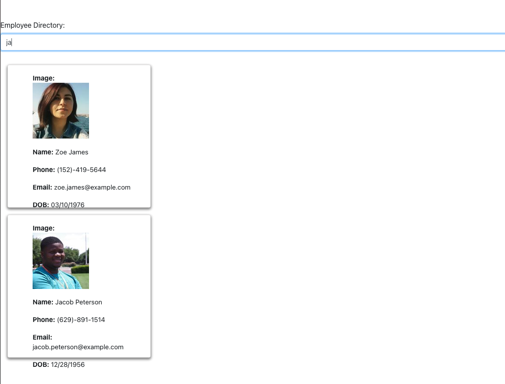

# employee-directory

# USER STORY
As a user, I want to be able to view my entire employee directory at once so that I have quick access to their information.
The user should be able to:

  * Sort the table by at least one category (in this case we are doing  name )

  * Filter the users by at least one property. (first and last name)

  # TECHNOLOGIES USED
  * Given a table of random users generated from the [Random User API](https://randomuser.me/), when the user loads the page, a table of employees should render. 
  * react
  

  # SCREEN SHOTS OF APP

 

  # CONTACT INFORMATION
  If you have any questions or concerns about this application, please contact me at gvane1919@gmail.com 

